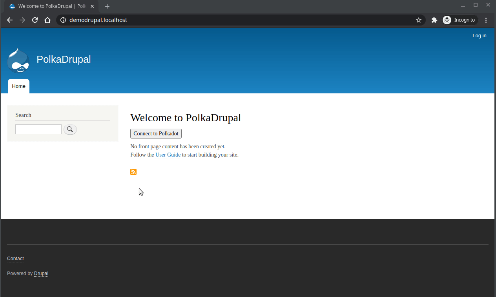

# PolkaDrupal

PolkaDot JS implementation core module for Drupal 8.8^ 9^

## Requirements

To connect to Polkadot network, you will need the [Polkadot{js} browser extension](https://polkadot.js.org/extension/).

## Module usage

Enable the module as usual.
You may use it as a basis for your own Polkadot & Drupal powered project, i.e with custom modules importing your own types and logic.

## Example block : sign message with an account

An example account selector block is provided with this module, where you can sign a message with your account.
Just place the "PolkaDrupal sign message example" block in one of your theme region.

## Bundled packages and versions

The following packages are bundled in this module :

    "@polkadot/api": "^3.9.3",
    "@polkadot/extension-dapp": "^0.37.1",
    "@polkadot/keyring": "^5.7.1",
    "@polkadot/util": "^5.7.1",
    "@polkadot/util-crypto": "^5.7.1"

Module updates will include packages bundle upgrades.

## Credits

[DarkDot community](https://darkdot.network) volunteers and helpers.

